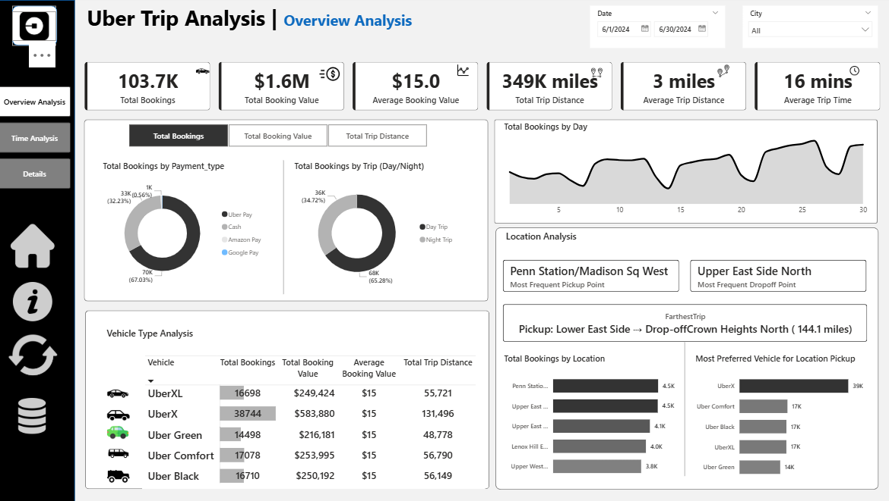
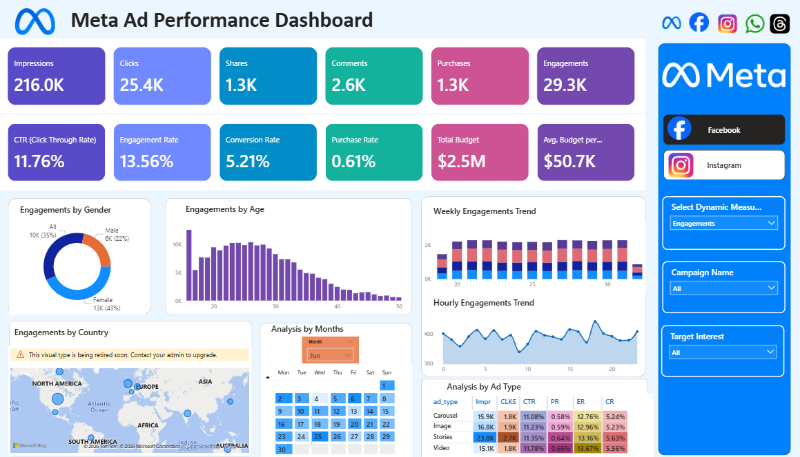
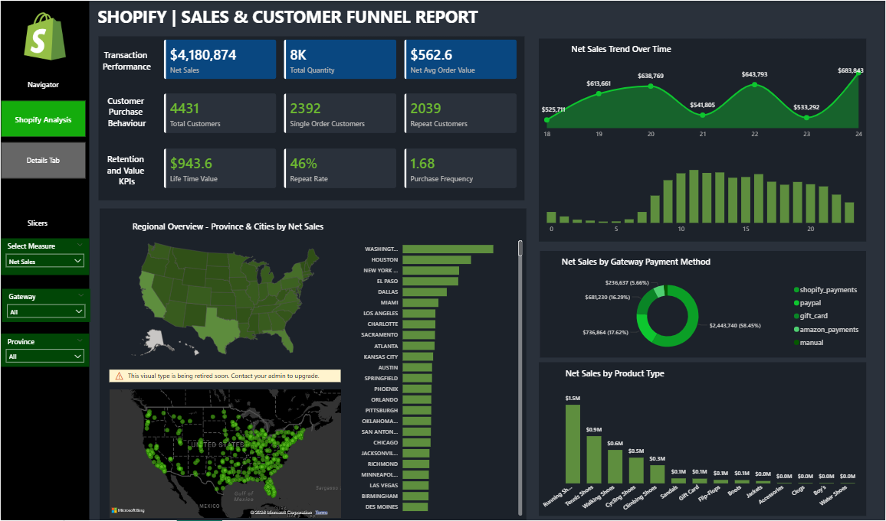
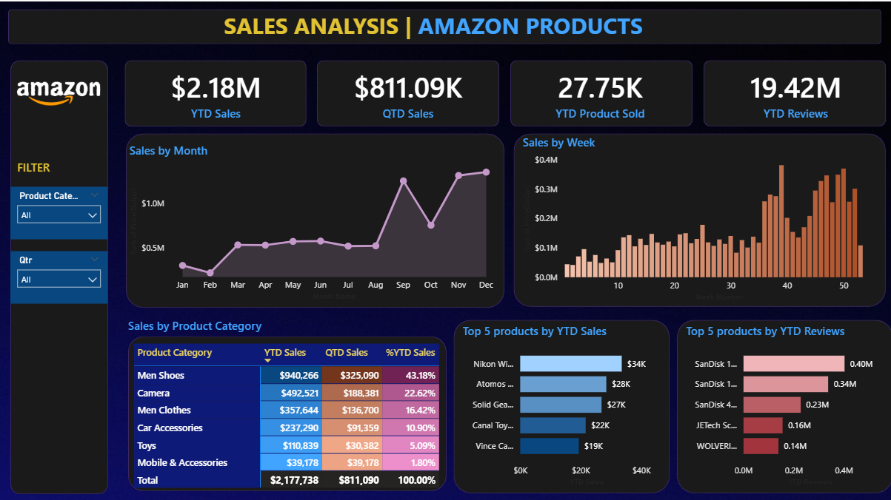
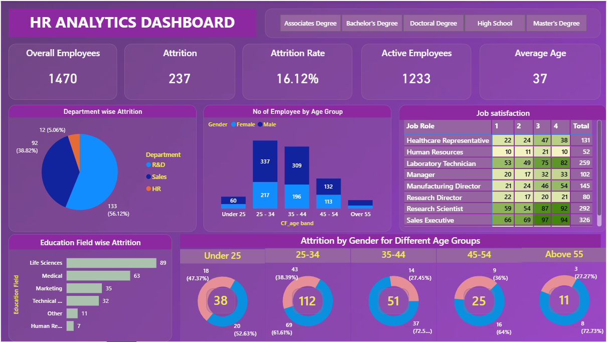

# Power BI Portfolio – Kaarthic

Welcome to my Power BI project portfolio.  
These projects demonstrate my skills in data modeling, DAX calculations, Power Query transformations, and interactive dashboard development.

## Projects

### 1️⃣ Uber Trip Analysis

Dashboard analyzing trip bookings, revenue trends, and trip efficiency.

🔗 [View Project](./Uber-Trip-Analysis)

### 2️⃣ Meta Ads Performance Analysis

Marketing performance dashboard analyzing campaign reach, engagement, and conversions.

🔗 [View Project](./Meta-Ads-Performance)

### 3️⃣ Shopify Sales Analysis

Sales analytics dashboard analyzing transactions, customer behavior, and lifetime value.

🔗 [View Project](./Shopify-Sales-Analysis)

### 4️⃣ Amazon Sales Analysis

Product sales performance dashboard analyzing revenue, ratings, and category trends.

🔗 [View Project](./Amazon-Sales-Analysis)

### 5️⃣ HR Analytics Dashboard

Employee workforce analytics dashboard analyzing attrition, demographics, and department performance.

🔗 [View Project](./HR-Analytics-Dashboard)

## Tools & Skills

**Business Intelligence & Visualization**
- Power BI
- Power BI Service
- Dashboard Design
- Data Storytelling

**Data Preparation & Modeling**
- Power Query
- Data Modeling (Star Schema)
- Data Transformation

**Data Analysis**
- DAX (Data Analysis Expressions)
- KPI Development
- Time Intelligence Calculations

**Database**
- SQL

**Certifications**
- Microsoft PL-300: Power BI Data Analyst
- Tableau Desktop Specialist
